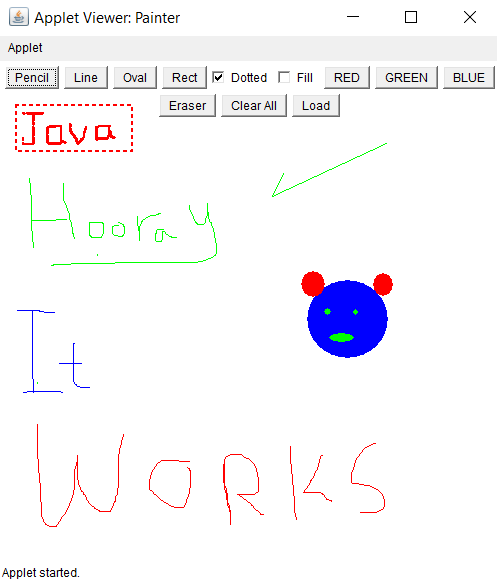

# Paint Brush Project Specifications

Paint Brush is an Applet-based application that enables the user to draw basic shapes with different colors and line strokes. The user can also clear all of the drawings or erase some parts of them. This project demonstrates the use of OOP design and implementation.

## Specifications

- `Colors Buttons`: The user should press one of these buttons before drawing to draw using this color. There should be at least the following buttons:
  - Red
  - Green
  - Blue

- `Shapes Buttons`: The user should press one of these buttons before drawing to draw a shape by dragging from a start point to an end point. The shape should be drawn while dragging till the user releases the mouse button. There should be the following buttons:
  - Rectangle
  - Oval
  - Line

- `Free Hand Button`: The user should press on this button to doodle while dragging.

- `Eraser Button`: The user should press on this button to be able to erase parts of the drawings.

- `Clear All Button`: The user should press on this button to clear all of the drawings from the drawing area.

- `Filled Checkbox`: If checked, it lets the Rectangle or Oval shapes that will be drawn after to be filled with the pre-selected color. If not checked, it lets the shapes to be drawn as outlines only.

- `Bonus`:
  - Dotted Checkbox: If checked, it lets the shapes line stroke to be dotted. If not checked, it lets the shapes line strokes to be solid.
  - Load Button: It enables the user to load an image to the drawing area.

This project specification outlines the main features and functionalities of the Paint Brush application.
